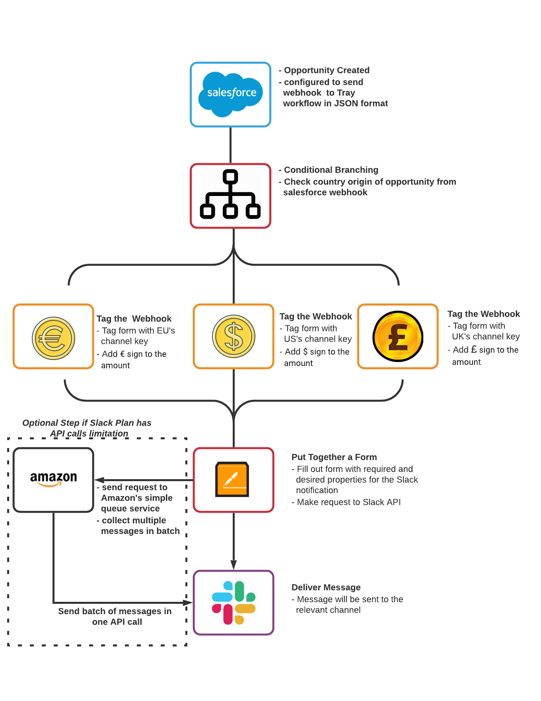
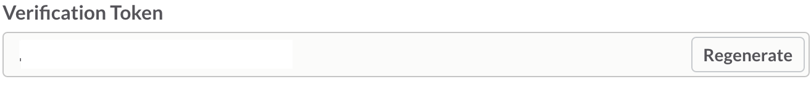
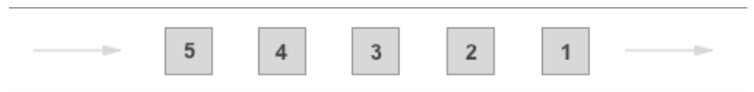
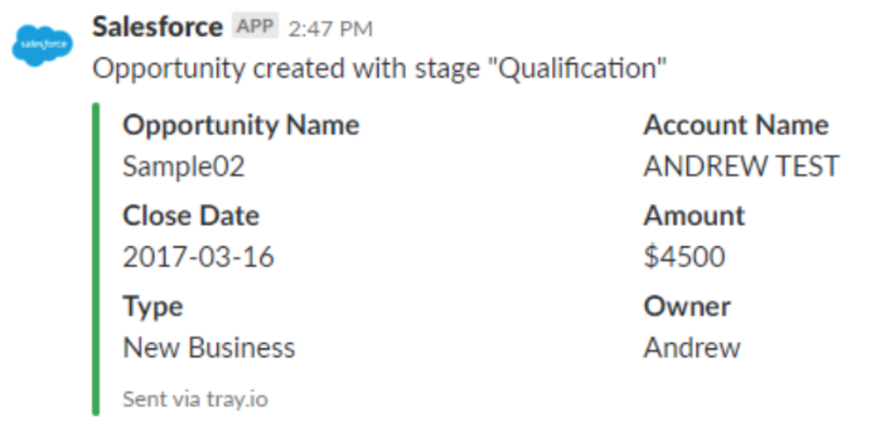

# Connecting Salesforce to Slack through Tray.io
By connecting `Salesforce` with `Slack`,
using the `Tray.io` platform, notification can be send to the relevant Slack Channel when  new opportunities are created in Salesforce. The data used to created the new opportunity in Salesforce will be send to a workflow on the Tray platform as webhook. 

Using a conditional operator, the country of which the opportunity is located can be sorted out. Then the data will be mapped into the correct format and an API request will be made to the Slack API. Finally, notification with the opportunity inforamtion will be sent to the relevant Slack channel.



### Requirement
```
- Slack Account with Admin permission (for building a slack application)
- Tray.io account (to use the Tray workflow)
```

## (1)Creating a Slack application (AKA Slack Chat Bot)
Creating a Slack application will be the first step to the integration. The application allows the user to use the Web API. Our objective is to use the API to send notification to our channel. When an application is created, a verification token will also be generated. This token will be needed for the later steps of the integration.
For more information on how to create the application, please reference this link:
https://slack.dev/node-slack-sdk/getting-started



## (2) Configuration of Salesforce
Assuming Salesforce is configured so that when opportunities are created, the action will also trigger a webhook (the data) to be sent to the Tray workflow.

```
#Example of webhook in JSON format
{
"id": "0065800000BwzJt",
"name": "Sample02",
"status": "Qualification",
"account": "Andrew Test",
"close_date": "2017-03-16",
"type": "New Business",
"country": "UK", // can also be US or EU
"owner_name": "Andrew",
"owner_email": "andrew@tray.io",
"amount": 4500
}
```

## (3) Identifying the Country Origin
The input data from the Salesforce webhook has a country key which it can possibly contain three different value which each value represent the country origin of the opportunity. In the conditional branching process, these value will be compared to the keywords so we can properly identify the country. 
- "UK" 🇬🇧
- "EU" 🇪🇺
- "US" 🇺🇸

## (4) Tagging the Data
Once we have properly identified the country of which the opportunities are coming from, we will need to tag the data so that they can be send to the relevant Slack channel. 

(4.1) Add the appropriate currency symbol
- £ for the UK
- € for the EU
- $ for the US

(4.2) Tagging the data with a channel name. This will be use later to identify which channel the notification will send to.
- UK-channel
- EU-channel
- US-channel

## (5) Making the API Request
Now that we have all we needed, we will format the data into the way the Slack API wants it. Instead of sending a plain text message, we want the notification to stand out so we would use an attachment. Once the Tray workflow has formatted the data, it will get sent to the Slack API.

```
# Example of how the data will be formatted using the webhook example given above

{
        token: "Put Your Token in This Field",
        channel: "US-channel",
        attachments:[
            pretext: "opportunity created with stage Qualification",
            fields: [
                {
                    "title": "Opportunity Name",
                    "value": "Sample02"                },
                {
                    "title": "Account Name",
                    "value": "Andrew Test"                },
                {
                    "title": "Close Date",
                    "value": "2017-03-16"                },
                 {
                    "title": "Amount",
                    "value": "$4500"                },
                 {
                    "title": "Type",
                    "value": "New Business"                },
                 {
                    "title": "Owner",
                    "value": "Andrew"                }
            ],
            "footer": "Sent via tray.io"
        ]
     }
```

## (5.5) Batching Up Messages 
If the version of Slack you are using is limited to 50 API calls per hour, this additional step may potential solve the problem. Using the `Amazon Simple Queue Services`(SQS), messages will first be sent to the queue and be bundle in batch. Once every 72 seconds, the SQS will make an API call to the Slack API requesting multiple messages to be post in a single call. By using the First-In-First-Out queque type (FIFO Queues), the messages will still be delivered in the order it was created. 


### Pros
- A work-around for the API calls limitation to Slack
- Messsges are still delivered in the order they were created

### Cons
- Message will not be delivered instantly as it was created
- Delay can be up to 72 seconds

## (6)Check the Result
To ensure everything is working as expected, one can test the integration by creating a new opportunity in Salesforce. If everything goes as planned, a notification will be sent to the relevant channel and the notification should look like this.



## (7) Other Resources
- Tray Workflow Overview: https://tray.io/documentation/platform/overview/
- Slack Documentation: 
    - Posting Message: https://api.slack.com/methods/chat.postMessage#channels
    - Constructing an Attachment: https://api.slack.com/docs/message-attachments


## (8) Conclusion
This is a high level, general overview of the integration. Many of details could not be documented out without accessing the Tray platform. Integration process may also deviate based on the how the CRM (Salesforce) is built out. 

Right now, the integration is designed for efficiency. Since the work being done for all three countries. Therefore, the one process can handle all three situation. If the three different country requires different process, additional steps may be necessary.

Lastly, I can explain the integration in more detail with I have access to Salesforce and Tray. Please let me know if you have any questions.

